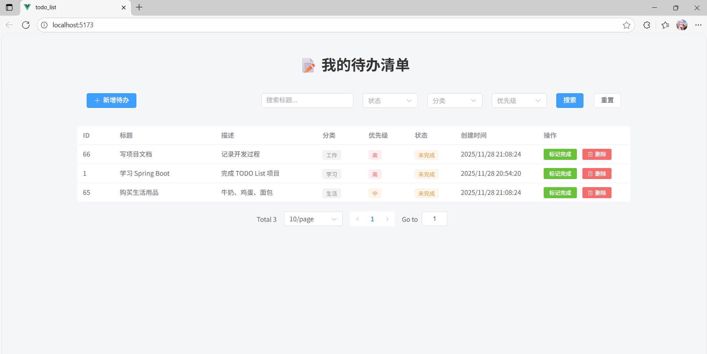

# TODO List 项目说明文档

## 1. 技术选型

### 后端技术栈
- **编程语言**：Java 17，理由：企业级应用标准，生态成熟稳定
- **框架**：Spring Boot 3.x，理由：快速开发、自动配置、丰富的starter
- **ORM框架**：MyBatis Plus，理由：简化CRUD操作，提供强大查询能力
- **数据库**：H2 Database，理由：内存数据库，开发测试便捷，无需额外安装
- **构建工具**：Maven，理由：Java项目标准构建工具

### 前端技术栈
- **框架**：Vue 3 + Element Plus，理由：现代化前端框架，组件丰富，开发效率高
- **构建工具**：Vite，理由：快速冷启动，热更新高效

### 替代方案对比
- **为什么不用 MySQL**：项目初期采用H2便于快速演示和开发，**生产环境可轻松切换至MySQL**
- **为什么不用 JPA**：MyBatis Plus在复杂查询和**自定义SQL**方面更灵活
- **为什么不用 React**：Vue 3 + Element Plus在**中后台管理系统**中开发效率更高

## 2. 项目结构设计

### 整体架构
采用前后端分离架构：
- 前端：Vue 3 SPA应用，通过RESTful API与后端交互
- 后端：Spring Boot REST API，提供数据接口
- 数据库：H2内存数据库，支持控制台访问

### 后端目录结构
```
src/
├── main/
│ ├── java/com/xiaochen/todo_list_backed/
│ │ ├── config/
│ │ │ ├── R.java # 统一返回结果封装
│ │ │ └── MyBatisPlusConfig.java
│ │ ├── controller/
│ │ │ └── TodoController.java
│ │ ├── entity/
│ │ │ └── TodoItem.java # 待办事项实体
│ │ ├── mapper/
│ │ │ └── TodoMapper.java
│ │ └── service/
│ │ └── TodoService.java
```

### 前端目录结构
```
src/
├── api/                    # API接口封装
├── components/             # 可复用组件
└── utils/                  # 工具函数
```

### 模块职责说明
- **controller**：接收请求，参数校验，返回响应
- **service**：业务逻辑处理
- **mapper**：数据库操作
- **entity**：数据模型定义
- **config**：配置类和通用组件
- **api**：API接口封装
- **components**：待办事项组件
- **utils**：axios封装

## 3. 需求细节与决策

### 数据模型设计

### 核心功能决策
1. **添加标题处理**：必填字段，前端表单规则验证，长度限制1-50字符
2. **完成状态显示**：UI中使用标签区分（绿色-已完成，橙色-未完成），表格中已完成的项添加删除线
3. **任务排序**：默认按**未完成优先 → 优先级高优先 → 创建时间倒序**排列
4. **空输入处理**：前端表单验证，提供友好错误提示
5. **数据持久化**：H2 文件数据库，开发环境轻量便捷，支持标准SQL，便于迁移到生产数据库，文件位置: `./data/tododb.mv.db`
6. **分页查询**：前端分页，后端分页，前端分页数据与后端分页数据一致

### 扩展功能决策
1. **搜索功能**：支持多条件组合搜索（标题关键词、完成状态、分类、优先级），**选择完成状态、分类、优先级条件后自动触发查询**，无需额外点击搜索按钮
## 4. AI 使用说明

### AI工具使用情况
- **使用工具**：deepseek，kimi
- **使用环节**：
    - 代码片段生成：前端组件初始化生成
    - Bug定位：MyBatis Plus分页查询问题、Vue响应式数据更新
    - 文档初稿：API接口文档、配置说明

### AI输出修改示例
- **后端修改**：优化了数据库存储和增删改查的参数传递
- **前端修改**：优化了更改状态的刷新，按钮的比例，添加的逻辑

## 5. 运行与测试方式

### 后端运行
```
 安装依赖 - 自动安装
# 启动应用
mvn spring-boot:run   或通过IDE运行main方法


# 访问H2控制台
http://localhost:8080/h2-console
```


### 前端运行
```
# 安装依赖
npm install

# 启动开发服务器
npm run dev

# 访问应用
http://localhost:5173
```
### 测试环境
- **后端**：Java 17、Spring Boot 3.5.8、Windows
- **前端**：Node.js 18+、Vue 3、Chrome/Firefox
- **数据库**：H2 Database

API测试示例
```
获取待办列表
GET http://localhost:8080/todo?page=1&pageSize=10

添加待办
POST http://localhost:8080/todo
Content-Type: application/json

{
"title": "学习Vue 3",
"description": "掌握Composition API",
"category": "学习",
"priority": 1
}
```
## 前端界面截图

### 已知问题与不足
1. **安全性**：未添加API鉴权，生产环境需要补充
2. **错误处理**：异常处理机制可以更加完善

## 6. 总结与反思

### 如果有更多时间，我会改进：
1. **用户体验**：添加拖拽排序、批量操作、键盘快捷键支持
2. **功能丰富**：增加子任务、标签系统、截止日期提醒
3. **技术深化**：添加Redis缓存、WebSocket实时同步
4. **监控运维**：日志集中管理、健康检查

### 实现的最大亮点：
1. **前后端分离架构**：清晰的API边界，便于独立开发和部署
2. **响应式前端设计**：基于Vue 3 Composition API，状态管理清晰
3. **RESTful API设计**：统一的返回格式和错误处理机制
4. **开发体验优化**：H2数据库控制台便于调试，热重载提升开发效率
